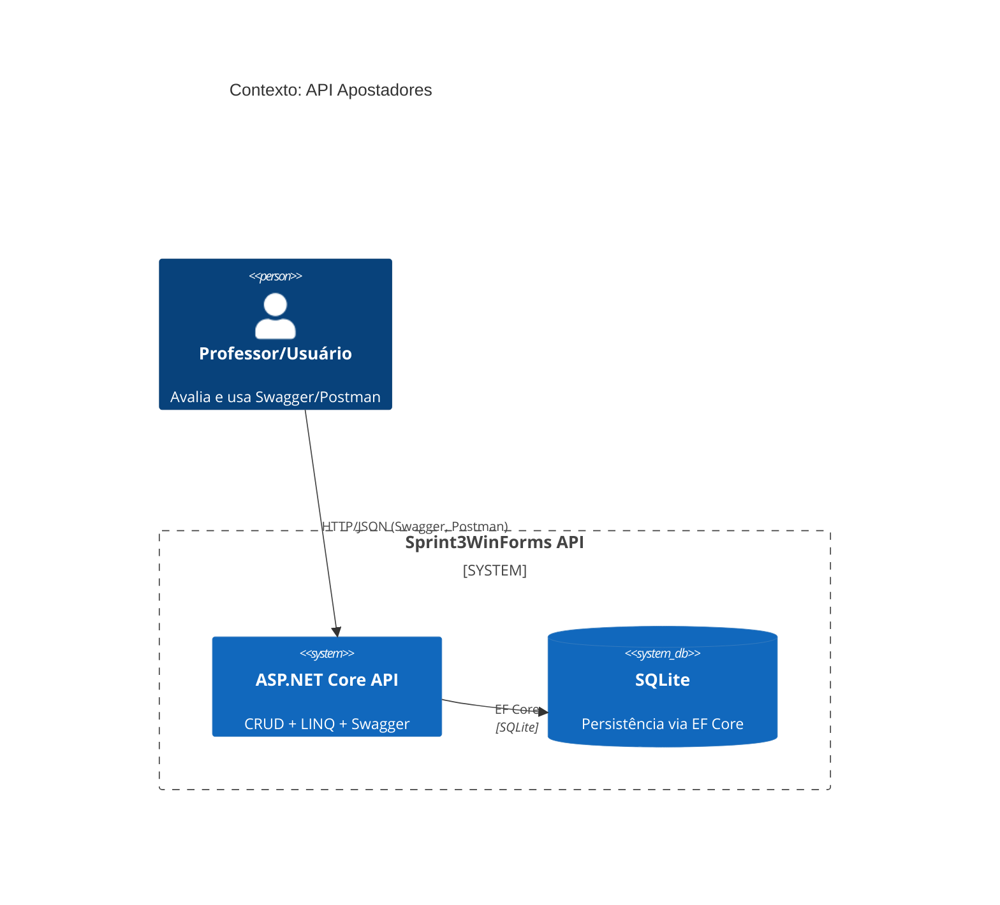
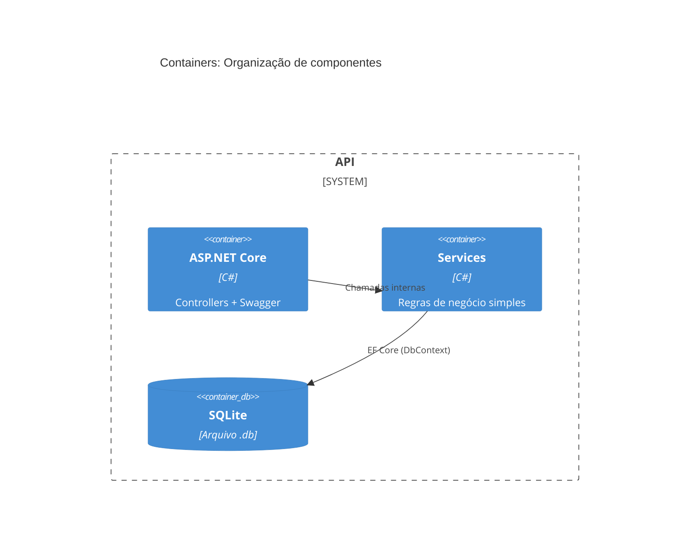
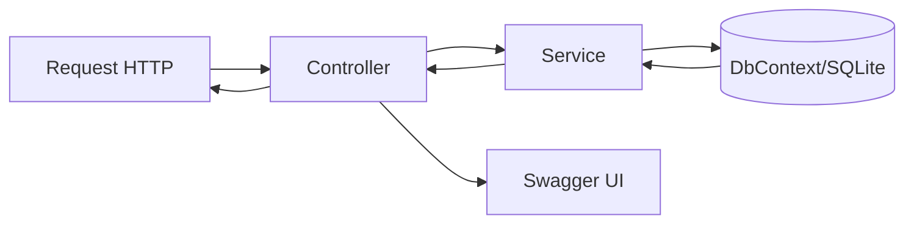
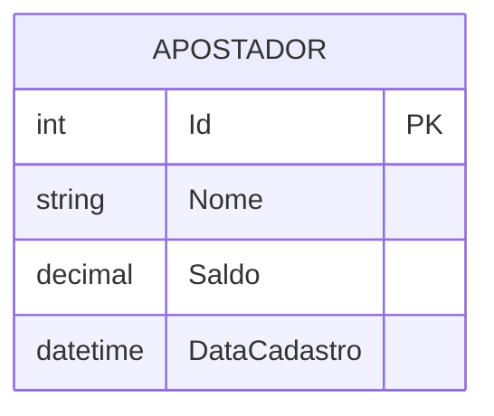
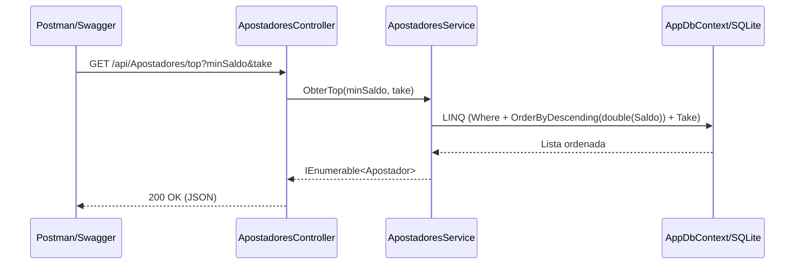

# Arquitetura — Sprint3WinForms

Abaixo estão os **diagramas Mermaid** (renderizam nativamente no GitHub).

## 1) Diagrama de Contexto (C4: System Context)

## 2) Diagrama de Containers (C4: Containers)

## 3) Diagrama Lógico (Camadas/Fluxo)

## 4) Modelo de Dados (ER)

## 5) Sequência — Exemplo GET /api/Apostadores/top

## Decisões Importantes

- **SQLite** escolhido pela simplicidade e portabilidade.
- **Ordenação por `decimal`**: conversão para `double` **apenas** no `OrderBy` para compatibilidade com SQLite.
- **Swagger** ativado sempre (ambiente acadêmico/demonstração).
